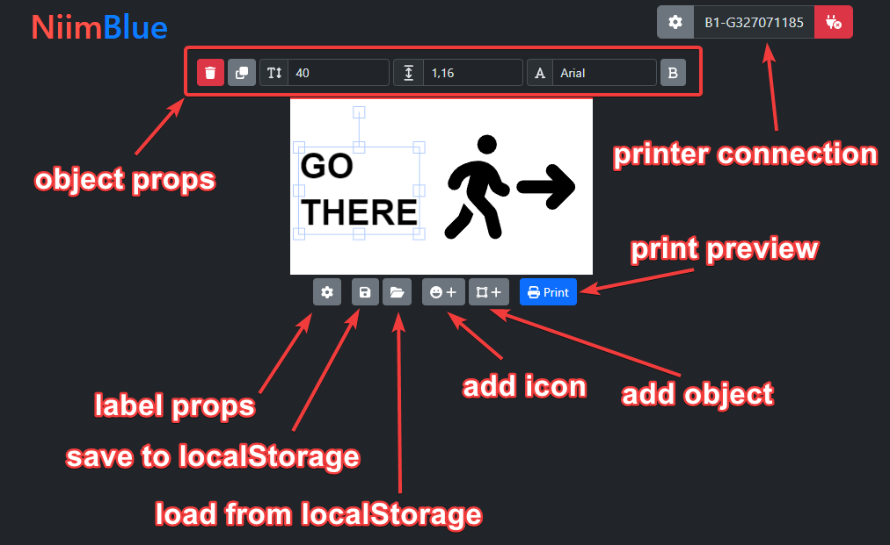
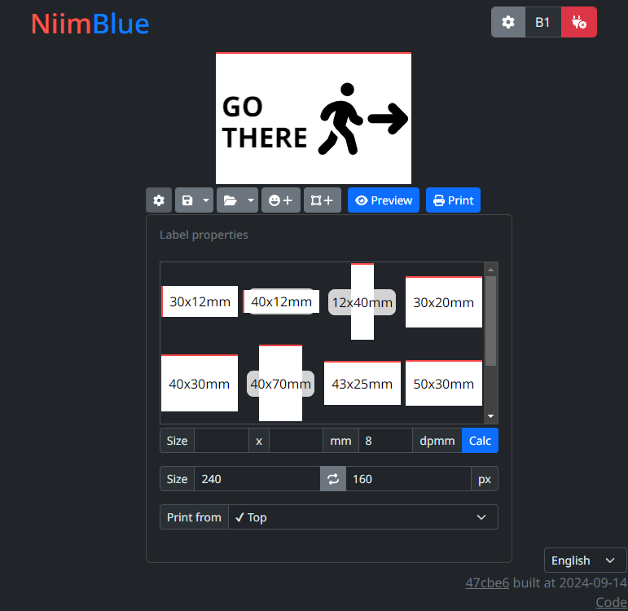
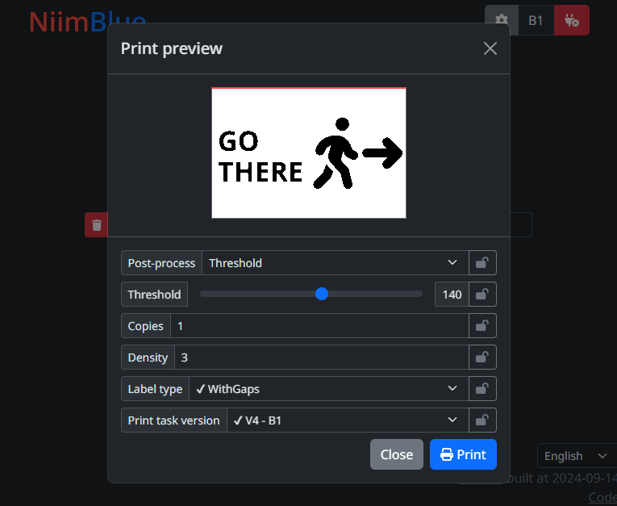
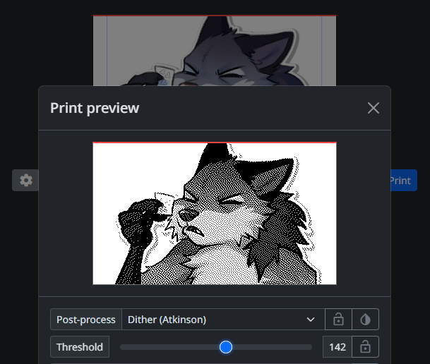
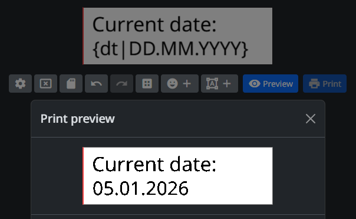
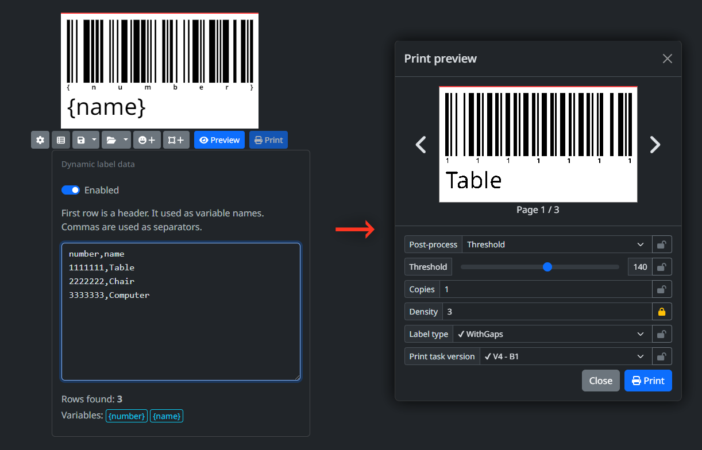
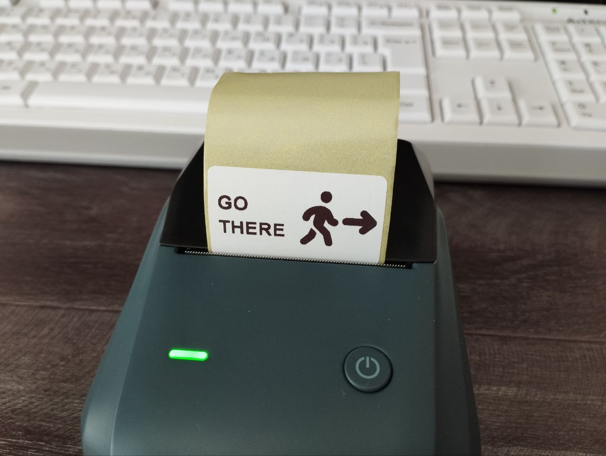
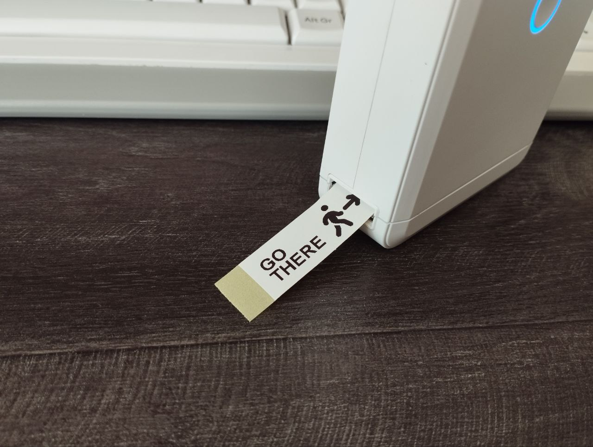

# NiimBlue

Niimbot printers webui. Design and print labels right from your browser.

Uses [NiimBlueLib](https://github.com/MultiMote/niimbluelib) for communication.

Project is deployed [here](https://niim.mmote.ru).

> [!NOTE]
> If you have printing problems, try different print task versions in print preview dialog. Make if default by pressing "Lock" button.
>
> If you found version suitable for your model, please write [here](https://github.com/MultiMote/niimbluelib/issues/1).

## Features

Key features:

* Privacy first! This application works completely offline and does not send any data (except for downloading application files and importing ZPL labels). Label data is stored in your browser.
* Support for both Bluetooth and USB connections.
* Rich label editor. Label saving, import/export.
* Print preview. You can see how your label will look like after post-processing. Several post-processing algorithms are available.
* Android App (Capacitor based).
* Most complete implementation of [NIIMBOT protocol](https://multimote.github.io/niimbluelib/documents/NIIMBOT_printers_protocol.html).

You can see the full list of implemented and planned features [on the Wiki](https://github.com/MultiMote/niimblue/wiki#features).

List of supported models you can find in [niimluelib](https://github.com/MultiMote/niimbluelib/issues/1) repository.

Demonstration video:

[](https://www.youtube.com/watch?v=u8QX-5e3W_A)

## Browser support

Your browser must support Web Bluetooth API: [supported browsers](https://developer.mozilla.org/en-US/docs/Web/API/Web_Bluetooth_API#browser_compatibility).

For serial communication: [supported browsers](https://developer.mozilla.org/en-US/docs/Web/API/Web_Serial_API#browser_compatibility).

In some systems you need to enable Chrome `Experimental Web Platform Features` (navigate to `chrome://flags`).

## Feedback needed!

I only have D110 and B1 printers. If you own other models, please write a comment [here](https://github.com/MultiMote/niimbluelib/issues/1) describing your model working or not.

Bluetooth dumps are MUCH appreciated (search how to enable **Bluetooth HCI Snoop Log** for your device, print any label with **Niimbot** app then run `adb bugreport filename`, you should find **btsnoop_hci.log** in the archive).

## Images

Images may be outdated, interface is changing constantly.

















## Launching development server

Skip steps you have done.

1. Install [git](https://git-scm.com)

2. Install [nodejs](https://nodejs.org)

3. Install [yarn](https://yarnpkg.com)

4. Clone repository

    ```bash
    git clone https://github.com/MultiMote/niimblue.git
    ```

5. Install dependencies

    ```bash
    yarn install
    ```

6. Run dev server

    Check code and open browser:

    ```bash
    yarn dev-check
    ```

    Or just run:

    ```bash
    yarn dev
    ```

Eslint not included. Install it with:

```bash
npm install --no-save --no-package-lock eslint@9.x globals @types/eslint @eslint/js typescript-eslint eslint-plugin-svelte
```

## Translation status

[](https://weblate.mmote.ru/engage/niimblue/)

## Other

|  Links |    |
|--------| -- |
| [](https://discord.gg/jXPAfZVd8a) | Discord (dev news, troubleshooting and other) |
