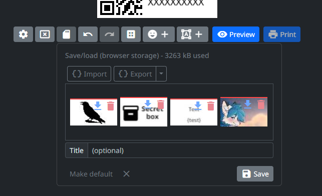

<div align="center">

[](https://niim.blue)

# NIIMBOT printers webui

Design and print labels right from your browser

[FAQ](https://github.com/MultiMote/niimblue/wiki/Frequently-asked-questions) | [Discord](https://discord.gg/jXPAfZVd8a) | [Telegram](https://t.me/niimblue) | [Boosty](https://boosty.to/multimote) | [NIIMBOT Community Wiki](https://printers.niim.blue)

[NiimBlueLib](https://github.com/MultiMote/niimbluelib) is used for communication

</div>

## Features

* Privacy first! This application works completely offline (at browser side) and does not send any data (except for downloading application files and importing ZPL labels). Label data is stored in your browser.
* Support for both Bluetooth and USB connections.
* Rich label editor. Label saving, import/export.
* Print preview. You can see how your label will look like after post-processing. Several post-processing algorithms are available.
* Android App (Capacitor based).
* Most complete implementation of [NIIMBOT protocol](https://printers.niim.blue/interfacing/proto/).

You can see more complete list of implemented and planned features [on the Wiki](https://github.com/MultiMote/niimblue/wiki#features).

Demonstration video:

[](https://www.youtube.com/watch?v=u8QX-5e3W_A)

## Supported printers

There is no exact list of supported models in this project. This project aims to support the maximum number of models.

You can check [a list of tested models here](https://github.com/MultiMote/niimbluelib/issues/1). If you own other model, please write a comment.

If your (new) printer model does not print, please make a [packet dump](https://github.com/MultiMote/niimblue/wiki/Making-packet-capture) of print with official application.

> [!NOTE]
> If you have printing problems, try different print task versions in print preview dialog. Make if default by pressing "Lock" button.


## Supported browsers

Your browser must support Web Bluetooth API: [supported browsers](https://developer.mozilla.org/en-US/docs/Web/API/Web_Bluetooth_API#browser_compatibility).

For serial communication: [supported browsers](https://developer.mozilla.org/en-US/docs/Web/API/Web_Serial_API#browser_compatibility).

Modern Chrome-based browsers should usually work.

In some systems you need to enable Chrome `Web Bluetooth` or `Experimental Web Platform Features` (navigate to `chrome://flags`).

## Images

Images may be outdated.


<details>
<summary>⬇ More images ⬇</summary>

Label properties:


Save/load menu:



Print preview dialog:


Post-processing:


Templating:


Dynamic data:


In real life:


</details>


## Launching development server

Skip steps you have done.

1. Install [git](https://git-scm.com)

2. Install [nodejs](https://nodejs.org)

3. Clone repository

    ```bash
    git clone https://github.com/MultiMote/niimblue.git
    ```

4. Install dependencies

    ```bash
    npm i
    ```

5. Run dev server

    Check code and run:

    ```bash
    npm run dev-check
    ```

    Or just run:

    ```bash
    npm run dev
    ```

To run own instance, build static files (`npm run build`) and host on yor web server,
or use [Docker Image](https://github.com/MultiMote/niimblue/wiki/Running-own-instance-with-Docker).

## Translations (click to contribute)

[](https://weblate.mmote.ru/engage/niimblue/)
